# Idem Database Schema

This document describes the database schema for the Idem Identity Provider.

## Schema Organization

All tables are in the `idem` PostgreSQL schema.

**Total tables: 17** (simplified single-tenant design)

## Entity Relationship Diagram

```mermaid
erDiagram
    %% Core Tables
    accounts ||--o{ identities : "has many"
    accounts ||--o{ emails : "has many"
    accounts ||--o{ account_claims : "has many"
    accounts ||--o{ otp_codes : "may have"
    accounts ||--o{ oidc_store : "has tokens"
    accounts ||--o{ audit_log : "actions logged"

    %% Identity & Profile
    identities {
        uuid id PK
        uuid account_id FK
        text provider
        text provider_subject
        text provider_issuer
        boolean is_primary
        boolean email_verified
        boolean phone_verified
        timestamp created_at
        timestamp updated_at
        timestamp last_used_at
    }

    accounts {
        uuid id PK
        text primary_email UK
        text display_name
        boolean active
        text given_name
        text middle_name
        text family_name
        text phone
        date birthdate
        text locale
        text timezone
        text picture
        text system_role "NULL or system_admin or admin_reader"
        timestamp created_at
        timestamp updated_at
        timestamp deleted_at
    }

    emails {
        uuid id PK
        uuid account_id FK
        text email UK
        boolean verified
        boolean is_primary
        text verification_token
        timestamp verification_token_expires_at
        timestamp verified_at
        timestamp created_at
        timestamp updated_at
    }

    %% OTP Authentication
    otp_codes {
        uuid id PK
        text recipient
        text recipient_type
        text code_hash
        uuid account_id FK
        integer attempts
        integer max_attempts
        boolean consumed
        timestamp expires_at
        text session_id
        timestamp created_at
        timestamp consumed_at
    }

    otp_rate_limits {
        uuid id PK
        text recipient
        text recipient_type
        integer request_count
        timestamp window_start
        timestamp window_end
        boolean blocked
        timestamp blocked_until
        timestamp created_at
        timestamp updated_at
    }

    %% Profile Claims (verified facts from IdPs)
    account_claims {
        uuid id PK
        uuid account_id FK
        text claim_type "email, phone_number, address, no:national_id"
        jsonb claim_value
        text source_provider
        timestamp source_verified_at
        jsonb raw_claims
        timestamp created_at
        timestamp updated_at
    }

    %% OAuth & OIDC
    oauth_clients {
        uuid id PK
        text client_slug UK
        text client_name
        text client_secret_hash
        jsonb redirect_uris
        jsonb grant_types
        jsonb response_types
        jsonb allowed_scopes
        jsonb default_scopes
        boolean require_pkce
        integer access_token_lifetime
        integer refresh_token_lifetime
        integer id_token_lifetime
        text logo_uri
        text client_uri
        text policy_uri
        text tos_uri
        jsonb contacts
        boolean active
        timestamp created_at
        timestamp updated_at
    }

    jwks_keys {
        uuid id PK
        text kid UK
        text use
        text alg
        text kty
        jsonb public_key
        text private_key_encrypted "AES-256-GCM with per-key salt"
        boolean active
        boolean primary
        timestamp rotated_at
        timestamp expires_at
        timestamp created_at
        timestamp updated_at
    }

    oidc_store {
        uuid id PK
        text name
        text oidc_id
        uuid account_id FK
        text client_id
        text grant_id
        text session_id
        text scope
        text uid
        jsonb payload
        timestamp expires_at
        timestamp consumed_at
        timestamp created_at
    }

    express_sessions {
        text sid PK
        jsonb sess
        timestamp expire
    }

    session_fingerprints {
        uuid id PK
        text session_id
        text ip_address
        text user_agent
        text user_agent_hash
        timestamp created_at
        timestamp last_seen_at
        integer violation_count
        timestamp last_violation_at
    }

    %% IdP Brokering
    idp_providers ||--o{ idp_states : "has states"
    idp_providers ||--o{ used_id_tokens : "tracks used tokens"

    idp_providers {
        uuid id PK
        text provider_key UK
        text provider_name
        text provider_type
        text issuer
        text authorization_endpoint
        text token_endpoint
        text userinfo_endpoint
        text jwks_uri
        text display_name
        text logo_url
        text button_color
        text client_id
        text client_secret_encrypted
        jsonb scopes
        text redirect_uri
        jsonb additional_params
        integer consecutive_failures
        timestamp last_failure_at
        timestamp last_success_at
        boolean enabled
        timestamp created_at
        timestamp updated_at
    }

    idp_states {
        uuid id PK
        text state UK
        text code_verifier
        text nonce
        uuid provider_id FK
        text return_to
        text session_id
        text ip_address
        text user_agent
        boolean consumed
        timestamp consumed_at
        timestamp expires_at
        timestamp created_at
    }

    used_id_tokens {
        uuid id PK
        text jti
        uuid provider_id FK
        text subject
        timestamp issued_at
        timestamp expires_at
        timestamp created_at
    }

    %% Operations & Monitoring
    audit_log {
        uuid id PK
        text event_type
        text event_category
        text actor_type
        uuid actor_id FK
        text actor_name
        text target_type
        text target_id
        text target_name
        text ip_address
        text user_agent
        text session_id
        text success
        text error_code
        text error_message
        jsonb metadata
        timestamp timestamp
    }

    cleanup_runs {
        uuid id PK
        text cleanup_type
        text status
        integer items_processed
        integer items_deleted
        integer items_failed
        timestamp started_at
        timestamp completed_at
        integer duration_ms
        text error_message
        text error_stack
        jsonb metadata
    }

    system_health {
        uuid id PK
        text check_type
        text status
        text value
        text threshold
        text message
        timestamp timestamp
    }
```



## Table Groups

### Core Identity (3 tables)

- **accounts** - User accounts with profile fields and optional admin role
- **identities** - Links to external IdPs (Vipps, HelseID, etc.)
- **emails** - Email addresses for accounts

### OTP Authentication (2 tables)

- **otp_codes** - One-time password codes for passwordless login
- **otp_rate_limits** - Rate limiting for OTP requests

### User Profile (1 table)

- **account_claims** - Verified identity claims from IdPs (email, phone, address, national ID, etc.)

### OAuth & OIDC (5 tables)

- **oauth_clients** - OAuth client registrations
- **jwks_keys** - JSON Web Keys for signing (private keys encrypted at rest)
- **oidc_store** - Token storage (for node-oidc-provider)
- **express_sessions** - Session data (PostgreSQL session store)
- **session_fingerprints** - Session hijacking detection

### IdP Brokering (3 tables)

- **idp_providers** - Registry of external IdPs with configuration
- **idp_states** - OAuth state tracking (CSRF protection)
- **used_id_tokens** - Token replay prevention

### Operations (3 tables)

- **audit_log** - Comprehensive audit trail
- **cleanup_runs** - Token cleanup job tracking
- **system_health** - Health check metrics

## Key Design Decisions

### PostgreSQL Schema

All tables are in the `idem` schema, providing namespace isolation:
```sql
CREATE SCHEMA "idem";
CREATE TABLE "idem"."accounts" (...);
```

### Schema Constraints

- **`accounts.system_role`** - CHECK constraint: `NULL | 'system_admin' | 'admin_reader'`
- **`jwks_keys.private_key_encrypted`** - Private keys encrypted at rest (AES-256-GCM)
- **`session_fingerprints`** - Tracks session changes for hijacking detection

### Performance Optimizations

- Strategic indexes on lookup columns
- JSONB for flexible metadata (claims, scopes, params)
- Cleanup jobs for expired tokens
- Partitioning strategy for audit logs (future)

## Indexes

Critical indexes are created for:

- Primary lookups (email, provider+subject, client_id)
- Foreign key relationships
- Token expiration queries (`expires_at`)
- Session lookups (`session_id`)
- Audit log queries (event_type, actor_id, timestamp)
- Account claims (account_id, claim_type, source_provider)

See migration file `0000_curvy_stellaris.sql` for complete index definitions.
