# Idem Database Schema

This document describes the database schema for the Idem Identity Provider.

## Schema Organization

All tables are in the `idem` PostgreSQL schema.

## Entity Relationship Diagram

```mermaid
erDiagram
    %% Core Tables
    accounts ||--o{ identities : "has many"
    accounts ||--o{ emails : "has many"
    accounts ||--o{ profile_person : "has one"
    accounts ||--o{ profile_facts : "has many"
    accounts ||--o{ addresses : "has many"
    accounts ||--o{ otp_codes : "may have"
    accounts ||--o{ oidc_store : "has tokens"
    accounts ||--o{ admin_principals : "may be admin"
    accounts ||--o{ audit_log : "actions logged"

    %% Identity & Profile
    identities {
        uuid id PK
        uuid account_id FK
        text provider
        text provider_subject
        text provider_issuer
        boolean is_primary
        boolean email_verified
        boolean phone_verified
        timestamp created_at
        timestamp updated_at
        timestamp last_used_at
    }

    accounts {
        uuid id PK
        text primary_email UK
        text display_name
        boolean active
        timestamp created_at
        timestamp updated_at
        timestamp deleted_at
    }

    emails {
        uuid id PK
        uuid account_id FK
        text email UK
        boolean verified
        boolean is_primary
        text verification_token
        timestamp verification_token_expires_at
        timestamp verified_at
        timestamp created_at
        timestamp updated_at
    }

    %% OTP Authentication
    otp_codes {
        uuid id PK
        text recipient
        text recipient_type
        text code_hash
        uuid account_id FK
        integer attempts
        integer max_attempts
        boolean consumed
        timestamp expires_at
        text session_id
        timestamp created_at
        timestamp consumed_at
    }

    otp_rate_limits {
        uuid id PK
        text recipient
        text recipient_type
        integer request_count
        timestamp window_start
        timestamp window_end
        boolean blocked
        timestamp blocked_until
        timestamp created_at
        timestamp updated_at
    }

    %% Profile
    profile_person {
        uuid id PK
        uuid account_id FK "unique"
        text given_name
        text middle_name
        text family_name
        text display_name
        text email
        text phone
        date birthdate
        text gender
        text locale
        text timezone
        text picture
        text website
        timestamp created_at
        timestamp updated_at
    }

    profile_facts {
        uuid id PK
        uuid account_id FK
        text fact_type
        text fact_value
        text source_provider
        timestamp source_verified_at
        jsonb raw_claims
        timestamp created_at
        timestamp updated_at
    }

    addresses {
        uuid id PK
        uuid account_id FK
        text address_type
        text street_address
        text locality
        text region
        text postal_code
        text country
        text formatted
        timestamp created_at
        timestamp updated_at
    }

    %% OAuth & OIDC
    oauth_clients {
        uuid id PK
        text client_id UK
        text client_name
        text client_secret_hash
        text client_type
        jsonb redirect_uris
        jsonb grant_types
        jsonb response_types
        jsonb allowed_scopes
        jsonb default_scopes
        boolean require_pkce
        integer access_token_lifetime
        integer refresh_token_lifetime
        integer id_token_lifetime
        text logo_uri
        text client_uri
        text policy_uri
        text tos_uri
        jsonb contacts
        boolean active
        timestamp created_at
        timestamp updated_at
    }

    jwks_keys {
        uuid id PK
        text kid UK
        text use
        text alg
        text kty
        jsonb public_key
        text private_key_encrypted
        boolean active
        boolean primary
        timestamp rotated_at
        timestamp expires_at
        timestamp created_at
        timestamp updated_at
    }

    oidc_store {
        uuid id PK
        text name
        text oidc_id
        uuid account_id FK
        text client_id
        text grant_id
        text session_id
        text scope
        text uid
        jsonb payload
        timestamp expires_at
        timestamp consumed_at
        timestamp created_at
    }

    express_sessions {
        text sid PK
        jsonb sess
        timestamp expire
    }

    session_fingerprints {
        uuid id PK
        text session_id
        text ip_address
        text user_agent
        text user_agent_hash
        timestamp created_at
        timestamp last_seen_at
        integer violation_count
        timestamp last_violation_at
    }

    %% IdP Brokering
    idp_providers ||--o{ idp_configs : "has config"
    idp_providers ||--o{ idp_states : "has states"
    idp_providers ||--o{ used_id_tokens : "tracks used tokens"

    idp_providers {
        uuid id PK
        text provider_key UK
        text provider_name
        text provider_type
        text issuer
        text authorization_endpoint
        text token_endpoint
        text userinfo_endpoint
        text jwks_uri
        text display_name
        text logo_url
        text button_color
        boolean enabled
        timestamp created_at
        timestamp updated_at
    }

    idp_configs {
        uuid id PK
        uuid provider_id FK
        text client_id
        text client_secret_encrypted
        jsonb scopes
        text redirect_uri
        jsonb additional_params
        integer consecutive_failures
        timestamp last_failure_at
        timestamp last_success_at
        boolean enabled
        timestamp created_at
        timestamp updated_at
    }

    idp_states {
        uuid id PK
        text state UK
        text code_verifier
        text nonce
        uuid provider_id FK
        text return_to
        text session_id
        text ip_address
        text user_agent
        boolean consumed
        timestamp consumed_at
        timestamp expires_at
        timestamp created_at
    }

    used_id_tokens {
        uuid id PK
        text jti
        uuid provider_id FK
        text subject
        timestamp issued_at
        timestamp expires_at
        timestamp created_at
    }

    %% Operations & Monitoring
    audit_log {
        uuid id PK
        text event_type
        text event_category
        text actor_type
        uuid actor_id FK
        text actor_name
        text target_type
        text target_id
        text target_name
        text ip_address
        text user_agent
        text session_id
        text success
        text error_code
        text error_message
        jsonb metadata
        timestamp timestamp
    }

    cleanup_runs {
        uuid id PK
        text cleanup_type
        text status
        integer items_processed
        integer items_deleted
        integer items_failed
        timestamp started_at
        timestamp completed_at
        integer duration_ms
        text error_message
        text error_stack
        jsonb metadata
    }

    system_health {
        uuid id PK
        text check_type
        text status
        text value
        text threshold
        text message
        timestamp timestamp
    }

    %% Admin RBAC
    admin_principals ||--o{ admin_memberships : "has roles"
    admin_principals ||--o{ admin_memberships : "granted roles"
    accounts ||--o| admin_principals : "may be admin"

    admin_principals {
        uuid id PK
        uuid account_id FK "unique"
        text display_name
        text email
        timestamp created_at
        timestamp updated_at
    }

    admin_memberships {
        uuid id PK
        uuid principal_id FK
        text role
        timestamp created_at
        uuid granted_by FK
    }
```



## Table Groups

### Core Identity (3 tables)
- **accounts** - User accounts
- **identities** - Links to external IdPs (Vipps, Google, etc.)
- **emails** - Email addresses for accounts

### OTP Authentication (2 tables)
- **otp_codes** - One-time password codes for passwordless login
- **otp_rate_limits** - Rate limiting for OTP requests

### User Profile (3 tables)
- **profile_person** - Personal information
- **profile_facts** - Verified identity facts from IdPs
- **addresses** - Address information

### OAuth & OIDC (4 tables)
- **oauth_clients** - OAuth client registrations
- **jwks_keys** - JSON Web Keys for signing
- **oidc_store** - Token storage (for node-oidc-provider)
- **express_sessions** - Session data
- **session_fingerprints** - Session hijacking detection

### IdP Brokering (4 tables)
- **idp_providers** - Registry of external IdPs
- **idp_configs** - Environment-specific IdP configurations
- **idp_states** - OAuth state tracking (CSRF protection)
- **used_id_tokens** - Token replay prevention

### Operations (3 tables)
- **audit_log** - Comprehensive audit trail
- **cleanup_runs** - Token cleanup job tracking
- **system_health** - Health check metrics

### Admin RBAC (2 tables)
- **admin_principals** - Administrative users
- **admin_memberships** - Role assignments

## Key Design Decisions

### PostgreSQL Schema
All tables are in the `idem` schema, providing namespace isolation:
```sql
CREATE SCHEMA "idem";
CREATE TABLE "idem"."accounts" (...);
```

### Single-Tenant Architecture
- No `tenant_id` or `org_id` columns
- Static issuer per environment
- Simplified queries and reduced complexity

### Security Features
- **OTP codes** are hashed before storage
- **Client secrets** use bcrypt hashing
- **Private keys** are encrypted at application level
- **Audit logging** for all sensitive operations
- **Rate limiting** for OTP and authentication endpoints
- **Token replay prevention** via `used_id_tokens`
- **Session hijacking detection** via `session_fingerprints`

### Performance Optimizations
- Strategic indexes on lookup columns
- JSONB for flexible metadata
- Cleanup jobs for expired tokens
- Partitioning strategy for audit logs

## Indexes

Critical indexes are created for:
- Primary lookups (email, provider+subject)
- Foreign key relationships
- Token expiration queries
- Session lookups
- Audit log queries

See migration file for complete index definitions.
