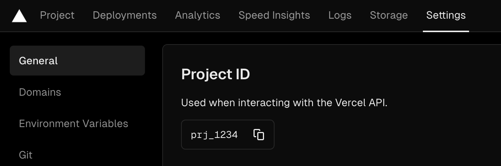
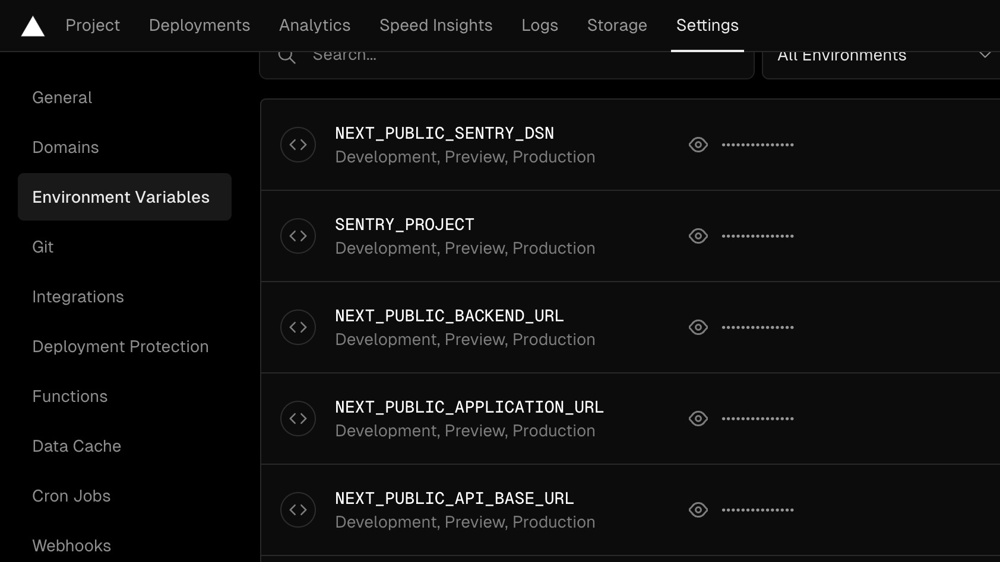
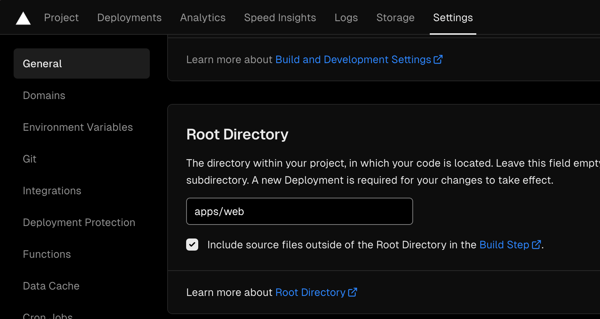

# Deploy frontend to Vercel

Deployment procedure for the frontend of the project to Vercel.

## Required information

1. Get the `project ID` from Vercel. It can be found at the Settings > General > Project ID.
   

2. Get your organization slug from Vercel. It is part of the url when looking at the project. For example, if the url is `https://vercel.com/organization/project`, then the organization slug is `organization`.

3. Get the `token` from Vercel. It can be found at the [account > tokens page](https://vercel.com/account/tokens).

## Setup the environment variables

Take a look at the `.env-template` in the apps folder.

## Set the root directory

In the page Settings > General, you could find the setting `Root Directory`, set the root directory to `apps/web`.

## Docsite project

The docsite requires pre:build to run for the docs to be copied, so make sure to override the build command in the Vercel settings to `npm run build`.

