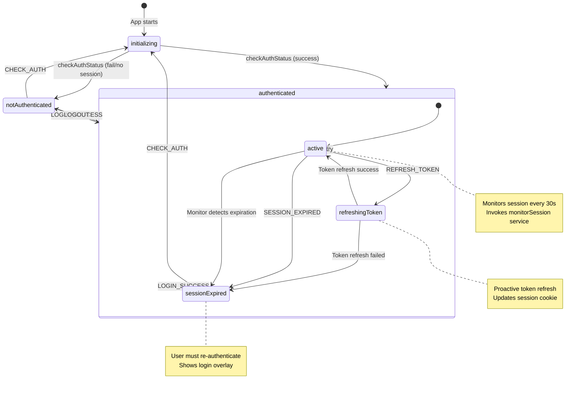
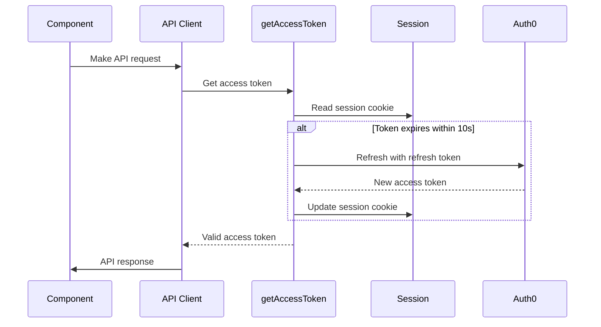
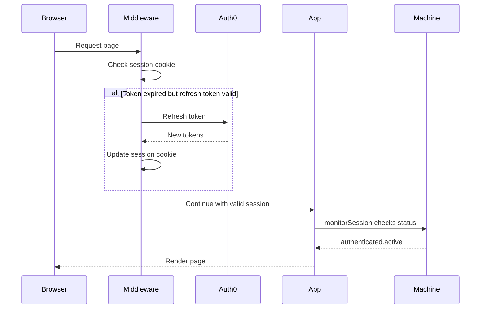

# @eventuras/fides-auth-next

Next.js-specific authentication library with XState-powered state management.

## Philosophy

This library provides:

1. **Next.js-specific helpers** that work with the framework-agnostic `@eventuras/fides-auth` library
2. **XState v5 authentication state machine** for robust, predictable auth state management
3. **React hooks** for easy integration with Next.js components

Use only what you need - the library is fully modular.

## Installation

```bash
pnpm add @eventuras/fides-auth-next
```

This will automatically install `@eventuras/fides-auth` as a dependency.

## What's Included

### XState Authentication State Machine

A production-ready state machine for managing authentication flows, session monitoring, and token refresh.

**Quick Start:**

```typescript
import { createAuthMachine, createAuthHooks } from '@eventuras/fides-auth-next/state-machine';
import { createActor } from 'xstate';

// 1. Create the machine
const authMachine = createAuthMachine({
  checkAuthStatus: async () => {
    // Your auth check logic
    return { authenticated: true, user: { name: 'John', email: 'john@example.com', roles: [] } };
  },
  config: {
    sessionMonitorInterval: 30_000, // 30 seconds
    loggerNamespace: 'myapp:auth',
    adminRole: 'Admin',
  },
});

// 2. Create the actor (running instance)
const authService = createActor(authMachine);

// 3. Create React hooks
const { useAuthSelector, useAuthActions } = createAuthHooks(authService);

// 4. Start the service
authService.start();
```

**[📖 See State Machine Documentation](#state-machine-documentation)**

### �🍪 Cookie Helpers

Safe cookie operations with clear documentation about where they can be used.

```typescript
import {
  setSessionCookie,
  getSessionCookie,
  deleteSessionCookie,
  setAuthCookie,
  getAuthCookie,
  deleteAuthCookie,
} from '@eventuras/fides-auth-next';

// In Server Actions, Route Handlers, or Server Components:
await setSessionCookie(encryptedJwt);
const jwt = await getSessionCookie();
await deleteSessionCookie();
```

**Important:** These functions can **ONLY** be used in:
- ✅ Server Actions (`'use server'`)
- ✅ Route Handlers (files in `app/api/`)
- ✅ Server Components (async React components)

They **CANNOT** be used in:
- ❌ Client Components (`'use client'`)
- ❌ Middleware (use `NextResponse.cookies` instead)

### 🔐 Session Management

High-level session functions for Next.js.

```typescript
import {
  getCurrentSession,
  createAndPersistSession,
  refreshCurrentSession,
  clearCurrentSession,
} from '@eventuras/fides-auth-next';

// Get current session
const session = await getCurrentSession();

// Create and save new session
await createAndPersistSession({
  tokens: { accessToken, refreshToken },
  user: { name: 'John', email: 'john@example.com' },
});

// Refresh session
const updated = await refreshCurrentSession(oauthConfig);

// Clear session
await clearCurrentSession();
```

### 🔄 Re-exported Core Functions

All framework-agnostic functions from `@eventuras/fides-auth` are re-exported:

```typescript
import {
  // OAuth
  buildPKCEOptions,
  buildAuthorizationUrl,
  refreshAccesstoken,
  
  // Session validation
  validateSessionJwt,
  
  // Session refresh
  refreshSession,
  
  // Silent login
  buildSilentLoginUrl,
  checkSilentLoginResult,
  
  // Utils
  createEncryptedJWT,
  accessTokenExpires,
  
  // Types
  type OAuthConfig,
  type Session,
  type Tokens,
} from '@eventuras/fides-auth-next';
```

## Common Patterns

### Login Flow (Route Handler)

```typescript
// app/api/login/auth0/route.ts
import {
  buildPKCEOptions,
  buildAuthorizationUrl,
} from '@eventuras/fides-auth-next';
import { NextRequest, NextResponse } from 'next/server';

export async function GET(request: NextRequest) {
  // 1. Build PKCE and auth URL
  const pkce = await buildPKCEOptions(oauthConfig);
  const authUrl = await buildAuthorizationUrl(oauthConfig, pkce);

  // 2. Create redirect response
  const response = NextResponse.redirect(authUrl.toString());

  // 3. Store PKCE in cookies (use NextResponse.cookies in route handlers)
  response.cookies.set('oauth_state', pkce.state, {
    httpOnly: true,
    secure: process.env.NODE_ENV === 'production',
    maxAge: 60 * 10, // 10 minutes
  });
  
  response.cookies.set('oauth_code_verifier', pkce.code_verifier, {
    httpOnly: true,
    secure: process.env.NODE_ENV === 'production',
    maxAge: 60 * 10,
  });

  return response;
}
```

### OAuth Callback (Route Handler)

```typescript
// app/api/login/auth0/callback/route.ts
import {
  createAndPersistSession,
} from '@eventuras/fides-auth-next';
import * as openid from 'openid-client';

export async function GET(request: Request) {
  // 1. Get stored PKCE values
  const cookies = await cookies();
  const state = cookies.get('oauth_state')?.value;
  const codeVerifier = cookies.get('oauth_code_verifier')?.value;

  // 2. Exchange code for tokens
  const tokens = await openid.authorizationCodeGrant(
    config,
    new URL(request.url),
    { pkceCodeVerifier: codeVerifier, expectedState: state }
  );

  // 3. Create and persist session
  await createAndPersistSession({
    tokens: {
      accessToken: tokens.access_token,
      refreshToken: tokens.refresh_token,
    },
    user: {
      name: 'John Doe',
      email: 'john@example.com',
    },
  });

  // 4. Clean up and redirect
  cookies.delete('oauth_state');
  cookies.delete('oauth_code_verifier');

  return Response.redirect('/');
}
```

### Protected Server Component

```typescript
// app/admin/page.tsx
import { getCurrentSession } from '@eventuras/fides-auth-next';
import { redirect } from 'next/navigation';

export default async function AdminPage() {
  const session = await getCurrentSession();
  
  if (!session) {
    redirect('/login');
  }

  return (
    <div>
      <h1>Welcome, {session.user?.name}</h1>
    </div>
  );
}
```

### Logout Action

```typescript
// app/actions/auth.ts
'use server';

import { clearCurrentSession } from '@eventuras/fides-auth-next';
import { redirect } from 'next/navigation';

export async function logoutAction() {
  await clearCurrentSession();
  redirect('/');
}
```

### Middleware with Token Refresh

```typescript
// middleware.ts
import {
  validateSessionJwt,
  accessTokenExpires,
  refreshCurrentSession,
  createSession,
} from '@eventuras/fides-auth-next';
import { NextRequest, NextResponse } from 'next/server';

export async function middleware(request: NextRequest) {
  const sessionCookie = request.cookies.get('session')?.value;
  
  if (!sessionCookie) {
    return NextResponse.redirect('/login');
  }

  const { status, session } = await validateSessionJwt(sessionCookie);

  if (status !== 'VALID' || !session) {
    return NextResponse.redirect('/login');
  }

  // Check if token needs refresh
  if (session.tokens?.accessToken && 
      accessTokenExpires(session.tokens.accessToken)) {
    try {
      const updated = await refreshCurrentSession(oauthConfig);
      const jwt = await createSession(updated);
      
      const response = NextResponse.next();
      response.cookies.set('session', jwt, {
        httpOnly: true,
        secure: process.env.NODE_ENV === 'production',
        maxAge: 60 * 60 * 24 * 30,
      });
      
      return response;
    } catch (error) {
      // Refresh failed, redirect to login
      return NextResponse.redirect('/login');
    }
  }

  return NextResponse.next();
}

export const config = {
  matcher: ['/admin/:path*', '/user/:path*'],
};
```

## Cookie Options

Pre-configured cookie options are available:

```typescript
import {
  defaultSessionCookieOptions,
  defaultOAuthCookieOptions,
} from '@eventuras/fides-auth-next';

// Session cookies: 30 days, httpOnly, secure in prod
console.log(defaultSessionCookieOptions);

// OAuth cookies: 10 minutes, httpOnly, secure in prod
console.log(defaultOAuthCookieOptions);
```

## Modular Usage

You can use functions individually or compose them:

```typescript
// Low-level: Use core functions
import { validateSessionJwt, createEncryptedJWT } from '@eventuras/fides-auth-next';

const { status, session } = await validateSessionJwt(jwt);
const newJwt = await createEncryptedJWT(updatedSession);

// High-level: Use convenience functions
import { getCurrentSession, clearCurrentSession } from '@eventuras/fides-auth-next';

const session = await getCurrentSession();
await clearCurrentSession();
```

## Environment Variables

Required:

```bash
SESSION_SECRET=your-32-byte-hex-secret
```

Generate:

```bash
openssl rand -hex 32
```

## TypeScript

Full TypeScript support with exported types:

```typescript
import type {
  Session,
  Tokens,
  OAuthConfig,
  CreateSessionOptions,
  SessionValidationResult,
  CookieOptions,
} from '@eventuras/fides-auth-next';
```


# Authentication State Machine

## Overview

The authentication system is powered by an XState v5 state machine from the `@eventuras/fides-auth-next` library. It manages all authentication states, session monitoring, and token refresh workflows with robust, predictable state management.

## Quick Reference

```typescript
// Use auth state in components
import { useAuthSelector, useAuthActions } from '@/auth/authMachine';

const { isAuthenticated, isAdmin, user, status } = useAuthSelector();
const { logout } = useAuthActions();

// Status flags: isInitializing, isSessionExpired, isRefreshingToken
```

**States:** `initializing` → `notAuthenticated` | `authenticated.active` | `authenticated.refreshingToken` | `sessionExpired`

**Key Features:**

- ✅ Automatic session monitoring every 30s
- ✅ Proactive token refresh before API calls (10s threshold)
- ✅ Clean OAuth integration (no manual event dispatching)
- ✅ Type-safe state and events
- ✅ Comprehensive logging

## Architecture



## State Definitions

### `initializing`

- **Purpose**: Check if user is already authenticated on app load
- **Actions**: Invokes `checkAuthStatus` service (calls `getAuthStatus()` server action)
- **Transitions**:
  - → `authenticated` if session exists and is valid
  - → `notAuthenticated` if no session or auth check fails

### `notAuthenticated`

- **Purpose**: User needs to log in
- **Actions**: Resets context to initial values
- **Transitions**:
  - → `authenticated` via `LOGIN_SUCCESS` event (after OAuth redirect)
  - → `initializing` via `CHECK_AUTH` event

### `authenticated`

Main operational state with two substates:

#### `authenticated.active`

- **Purpose**: Normal operation, user is logged in
- **Actions**: 
  - Invokes `monitorSession` service (polls `getAuthStatus()` every 30s)
  - Detects session expiration automatically
- **Transitions**:
  - → `authenticated.refreshingToken` via `REFRESH_TOKEN` event (manual refresh)
  - → `sessionExpired` via `SESSION_EXPIRED` event
  - → `sessionExpired` when monitor detects expiration
  - → `notAuthenticated` via `LOGOUT` event

#### `authenticated.refreshingToken`

- **Purpose**: Token refresh in progress (manual or proactive)
- **Actions**: Invokes `refreshAccessToken` service
- **Transitions**:
  - → `authenticated.active` when token refresh succeeds
  - → `sessionExpired` when token refresh fails

### `sessionExpired`

- **Purpose**: Session has expired, user must re-authenticate
- **Actions**: 
  - Clears user context
  - Sets error to "Session expired"
- **Transitions**:
  - → `initializing` via `CHECK_AUTH` event
  - → `authenticated` via `LOGIN_SUCCESS` event (after re-login)

## Events

| Event | Description | Payload |
|-------|-------------|---------|
| `CHECK_AUTH` | Manually trigger auth status check | None |
| `SESSION_EXPIRED` | Session has expired | None |
| `LOGOUT` | User initiated logout | None |
| `LOGIN_SUCCESS` | OAuth login completed | `{ user: SessionUser }` |
| `REFRESH_TOKEN` | Trigger manual token refresh | None |

**Note**: The machine primarily uses internal transitions from service invocations rather than external events. The `monitorSession` service automatically detects expiration and transitions to `sessionExpired` without requiring explicit events.

## Context

```typescript
type AuthMachineContext = {
  user: SessionUser | null;
  isAdmin: boolean;
  error: string | null;
  lastChecked: Date | null;
};

type SessionUser = {
  name: string;
  email: string;
  roles: string[];
};
```

## Services (Actors)

### `checkAuthStatus`

- **Type**: `fromPromise`
- **Purpose**: Checks current authentication status on app load or on demand
- **Implementation**: Calls `getAuthStatus()` server action
- **Returns**: `{ authenticated: boolean, user?: SessionUser }`
- **Behavior**: Throws error on failure, transitions handled by machine

### `monitorSession`

- **Type**: `fromPromise` with recursive polling
- **Purpose**: Continuously monitors session validity
- **Implementation**: 
  - Polls `getAuthStatus()` at configured interval (default: 30 seconds)
  - Automatically detects session expiration
  - Throws error to trigger transition to `sessionExpired`
- **Configuration**: Interval configurable via `sessionMonitorInterval` option

### `refreshAccessToken`

- **Type**: `fromPromise`
- **Purpose**: Manually triggers token refresh
- **Implementation**: 
  - Calls `getAuthStatus()` which checks token validity
  - Proactive refresh happens in `getAccessToken()` utility
- **Note**: Most token refreshes happen proactively before API calls, not through this service

## Token Refresh Strategy

The system uses a **proactive token refresh** approach:



**Key points:**

- Token expiration is checked **before** every API request
- Tokens expiring within 10 seconds are refreshed preemptively  
- Refresh happens in `getAccessToken()` utility, used by API client interceptor
- Session cookie is automatically updated with new tokens
- On refresh failure (e.g., expired refresh token), user sees session expired overlay

## Component Integration

### Machine Configuration

```typescript
// apps/web/src/auth/authMachine.ts
import { createActor } from 'xstate';
import { createAuthMachine, createAuthHooks } from '@eventuras/fides-auth-next/state-machine';
import { getAuthStatus } from '@/utils/auth/getAuthStatus';

// Create the configured auth machine
const authMachine = createAuthMachine({
  checkAuthStatus: getAuthStatus,
  config: {
    sessionMonitorInterval: 30_000, // 30 seconds
    loggerNamespace: 'web:auth',
    adminRole: 'Admin',
  },
});

// Create the auth service actor (running instance)
export const authService = createActor(authMachine);

// Create React hooks for accessing auth state and actions
export const { useAuthSelector, useAuthActions } = createAuthHooks(authService);
```

### Providers Setup

```typescript
// apps/web/src/app/Providers.tsx
'use client';

import { useEffect } from 'react';
import { authService } from '@/auth/authMachine';
import { Logger } from '@eventuras/logger';

const logger = Logger.create({ namespace: 'web:app' });

export function Providers({ children }) {
  useEffect(() => {
    authService.start();
    logger.info('Auth service started');
    
    // Development-mode logging
    if (process.env.NODE_ENV === 'development') {
      const subscription = authService.subscribe(state => {
        logger.debug({ 
          state: state.value,
          user: state.context.user?.name 
        }, 'Auth state changed');
      });
      return () => {
        subscription.unsubscribe();
        authService.stop();
      };
    }
    
    return () => authService.stop();
  }, []);

  return <>{children}</>;
}
```

### Reading Auth State

```typescript
import { useAuthSelector } from '@/auth/authMachine';

export function MyComponent() {
  const authState = useAuthSelector();
  const { 
    isAuthenticated,
    isAdmin,
    user,
    status 
  } = authState;

  // Status flags available:
  // - status.isInitializing
  // - status.isSessionExpired
  // - status.isRefreshingToken

  if (status.isInitializing) {
    return <div className="w-20 h-10" aria-label="Loading..." />;
  }
  
  if (!isAuthenticated) {
    return <LoginButton />;
  }
  
  return <div>Welcome, {user?.name}!</div>;
}
```

### Using Auth Actions

```typescript
import { useAuthActions } from '@/auth/authMachine';

export function SessionExpiredOverlay() {
  const { logout } = useAuthActions();

  const handleLoginNow = () => {
    // Redirect to login endpoint
    window.location.href = '/api/login';
  };

  return (
    <Dialog>
      <Button onClick={handleLoginNow}>
        Login now
      </Button>
      <Button onClick={logout}>
        Cancel
      </Button>
    </Dialog>
  );
}
```

## OAuth Flow Integration

The machine automatically detects successful logins:

1. User clicks login → `/api/login` redirects to Auth0
2. Auth0 redirects to `/api/login/auth0/callback`
3. Callback sets session cookie and redirects to `returnTo` page
4. Page reloads → `Providers` remounts → machine restarts
5. Machine enters `initializing` state → invokes `checkAuthStatus`
6. Service detects session → sends `AUTH_VALIDATED` event
7. Machine transitions to `authenticated.active`

**No manual event dispatching needed for OAuth flow!**

## Middleware Integration

The Next.js middleware handles:

- Session validation on every request
- Automatic token refresh when access token expires
- Route protection (redirects unauthenticated users)

The middleware works transparently with the state machine:



**Key points:**

- Middleware refreshes tokens **before** requests reach the app
- State machine detects expired sessions through `monitorSession`
- No communication needed between middleware and machine
- Machine polls `getAuthStatus()` which reads the updated session cookie

## Benefits Over Previous Approach

### Before

- ❌ Components directly polling `getAuthStatus()` every 30s
- ❌ No centralized state management
- ❌ Race conditions possible between polling and user actions
- ❌ Impossible states (e.g., user data without authenticated flag)
- ❌ Hard to test state transitions
- ❌ Inconsistent error handling

### After (State Machine)

- ✅ Single source of truth for auth state
- ✅ Explicit state modeling prevents impossible states
- ✅ Predictable state transitions with visual diagrams
- ✅ Type-safe events and context
- ✅ Centralized service invocation (monitoring, refresh)
- ✅ Easier to test (can mock services)
- ✅ Better error handling with clear failure paths
- ✅ Comprehensive logging at every transition
- ✅ Clean separation of concerns:
  - Machine = state management
  - Middleware = token refresh on requests
  - getAccessToken = proactive token refresh before API calls
- ✅ Easy to extend (can add MFA, profile management, etc.)

## Logging

All state transitions and service invocations are logged with structured logging:

```typescript
import { Logger } from '@eventuras/logger';

const logger = Logger.create({
  namespace: 'web:auth',
  context: { component: 'AuthenticationFlowMachine' }
});

// Example logs:
logger.info('Checking authentication status');
logger.info({ user: context.user }, 'User authenticated');
logger.warn('Session warning - expires in 30s');
logger.error({ error }, 'Failed to refresh token');
```


## Debugging

### XState DevTools (Optional)
```typescript
import { createBrowserInspector } from '@statelyai/inspect';

if (typeof window !== 'undefined' && process.env.NODE_ENV === 'development') {
  const inspector = createBrowserInspector();
  
  const authServiceWithInspector = createActor(AuthenticationFlowMachine, {
    inspect: inspector.inspect,
  });
}
```

### State Change Logging
```typescript
// Already implemented in Providers.tsx
useEffect(() => {
  if (process.env.NODE_ENV === 'development') {
    const subscription = authService.subscribe(state => {
      logger.debug({ 
        state: state.value,
        context: state.context,
      }, 'Auth state changed');
    });
    return () => subscription.unsubscribe();
  }
}, []);
```

## Implementation Details

### Key Files

**State Machine Configuration:**

- `/libs/fides-auth-next/src/state-machine/machine.ts` - Core XState machine factory
- `/apps/web/src/auth/authMachine.ts` - App-specific configuration
- `/libs/fides-auth-next/src/state-machine/hooks.ts` - React hooks factory

**Integration:**

- `/apps/web/src/app/Providers.tsx` - Starts/stops auth service
- `/apps/web/src/components/eventuras/UserMenu.tsx` - Uses auth state for UI
- `/apps/web/src/components/SessionWarningOverlay.tsx` - Shows expiration dialog
- `/apps/web/src/utils/auth/getAuthStatus.ts` - Server action for checking status
- `/apps/web/src/utils/getAccesstoken.ts` - Proactive token refresh utility
